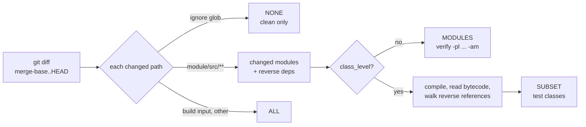
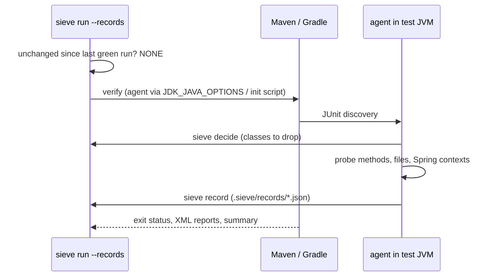
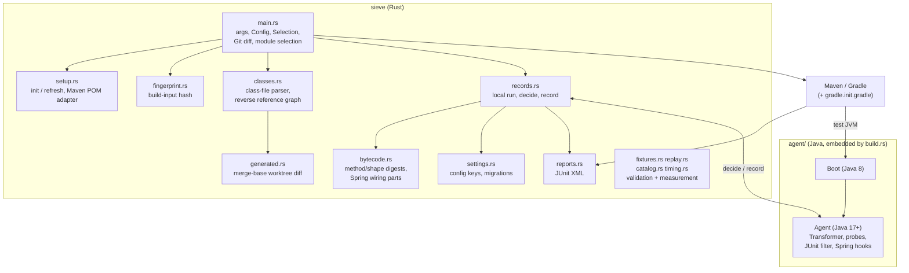

<p align="center"></p>

<p align="center">Run only the JVM tests a change can affect. When unsure, run them all.</p>

Sieve is a Rust CLI for Java and Kotlin/JVM projects built with Maven or Gradle. It
reads the Git diff, decides which modules and test classes a change can reach, and runs
them through the project's own build. Selection is conservative: build-script edits,
unknown paths, or missing Git history always select the full suite.

## Install

Prebuilt binary (Linux x86_64/arm64, macOS Apple silicon):

```bash
curl -fsSL https://raw.githubusercontent.com/preacherxp/sieve/master/install.sh | sh
```

From source (Rust 1.92+, JDK 17+ `javac` for the embedded agent):

```bash
cargo install --git https://github.com/preacherxp/sieve --locked
```

## Quick start

```bash
sieve init                              # detects Maven/Gradle, writes impact.json
sieve run --workspace . --base origin/main
```

`init` writes `impact.json` (module graph, ignore globs, options) and, for Maven, adds
per-module `skipTests` properties to the POMs. Commit both. Run `sieve refresh` after
build changes. Gradle needs no build-file edits; a bundled init script does the work.

```bash
sieve select --base origin/main         # preview the decision, no build
sieve run --base origin/main --output /tmp/selection.json -- -Pci
sieve run --full                        # always everything
```

## How it works



Three selection paths share one `Selection` type and one build runner:

| Path | Opt-in | Evidence | Picks | Best for |
|---|---|---|---|---|
| Module-level | default | Git diff + declared module graph | modules | multi-module CI |
| Class-level | `"class_level": true` | bytecode of the compiled revision | test classes | single-module CI, Spring apps |
| Local mode | `run --records` | what each test executed and read last time | test classes | developer machines |

**Module-level** follows the graph in `impact.json` and runs `verify -pl <selected> -am`
(Maven) or `:<module>:check` (Gradle).

**Class-level** compiles the selected modules, then walks reverse references through
constant pools, supertypes, string-named classes, and Kotlin inline maps. Changed DI
components select every context test; Spring Boot slices narrow that. Anything it cannot
map (deleted sources, resources, unreadable classes) falls back to the module selection.

**Local mode** loads a Java agent into the test JVM. It records every project method and
workspace file each test class touched, and on the next run drops classes whose records
are unchanged. Spring wiring and `application.yml` keys are compared per member and per
key, so most edits rerun only the tests that executed them.



## Measured

Twenty commits of a Spring Boot service with Testcontainers (62 test classes, 233 tests)
replayed with `sieve replay --walk --plant`, seconds per commit kind, Maven. Every planted
bug was caught; no real failure was missed.

```mermaid
%%{init: {"themeVariables": {"xyChart": {"plotColorPalette": "#b0772c, #2c6cb0"}}}}%%
xychart-beta
    title "Local mode, 20 commits: native build vs Sieve (seconds)"
    x-axis ["4 narrow commits", "14 wide commits", "2 build-input commits", "total"]
    y-axis "seconds" 0 --> 3500
    bar [660, 2288, 362, 3310]
    bar [84, 1145, 362, 1591]
```



Amber is the native full build, blue is Sieve. Total: 3,310 s to 1,591 s (-52%); Gradle
shows -54%.

Thirty first-parent commits of `apache/commons-text` (103 test classes), class-level,
`sieve replay --run`:

```mermaid
%%{init: {"themeVariables": {"xyChart": {"plotColorPalette": "#b0772c, #2c6cb0"}}}}%%
xychart-beta
    title "commons-text, 30 commits: full build vs Sieve (seconds)"
    x-axis ["15 docs/CI commits (NONE)", "7 source commits (SUBSET)"]
    y-axis "seconds" 0 --> 300
    bar [256, 118]
    bar [13, 73]
```



Class-level selection costs a second build-tool start, so cheap suites get slower: a
single-module sample with a 6 s setup went from 7.4 s to 2.3 s, while the same sample with
no setup went from 1.4 s to 2.2 s. Leave `class_level` off for cheap suites.

Full data, machines, and caveats: [docs/performance.md](docs/performance.md).

## CI

Pull requests select against the base; everything else runs the full suite.

```yaml
- uses: actions/checkout@v4
  with: { fetch-depth: 0, persist-credentials: false }
- run: cargo install --git https://github.com/preacherxp/sieve --locked --rev <sha>
- run: |
    args=()
    if [ "$EVENT" = pull_request ]; then args=(--base "$BASE"); else args=(--full); fi
    sieve run --workspace . "${args[@]}" --output "$RUNNER_TEMP/selection.json"
  env:
    EVENT: ${{ github.event_name }}
    BASE: ${{ github.event.pull_request.base.sha }}
```

Local-mode records can be shared across CI runs with `sieve run --ci` and a cache of
`.sieve/records`; see [the reference](docs/reference.md#records-in-ci). Keep a full-suite
job on the default branch.

## Architecture



| Path | Contents |
|---|---|
| `src/` | CLI modules above and the Gradle init script |
| `agent/` | Java agent, bootstrap probe, API stubs, vendored ASM |
| `tests/` | Integration tests: `cli`, `setup`, `native`, `oracle`, `safety`, `records`, `replay`, `workflows` |
| `projects/` | Fixtures: `maven`/`gradle` parity pair, `single-*`, `records`, `containers` |
| `samples/` | `bookstore`, `webshop` (5 Spring WebFlux services), `selective-performance` |
| `scenarios.json` | Independent oracle for fixture mutations; the selector never reads it |
| `docs/adr/` | Decisions: runtime evidence, in-JVM selection, Gradle local mode, construction is not use, CI records |

Invariants: unknown change widens to `ALL`; build and test failures propagate; selection
JSON is written before tests run; fixture expectations stay independent of selector code.
Details in [ARCHITECTURE.md](ARCHITECTURE.md).

## Develop

```bash
cargo fmt --check && cargo clippy --locked --all-targets -- -D warnings
cargo test --locked
cargo build --locked
target/debug/sieve fixtures verify --tool both --scenario all --selected
cargo test --locked --test records -- --include-ignored --test-threads=1   # Maven, Gradle, JDK 17+
```

## Limits

Static analysis cannot see classes named in resources outside `src/`, reflection on
non-constant strings, or scanners it does not know. Records assume tests are independent
and that passing runs covered their paths; undeclared environment, external services, and
floating container tags are not tracked. Single-package or direct-child module layouts
only; no composite builds, Android, or Multiplatform.

## More

- [docs/reference.md](docs/reference.md): every flag, config key, fallback rule, and CI detail
- [ARCHITECTURE.md](ARCHITECTURE.md), [CONTEXT.md](CONTEXT.md), [docs/adr](docs/adr)
- [docs/performance.md](docs/performance.md), [docs/test-coverage.md](docs/test-coverage.md)
- [docs/local-mode-adoption.md](docs/local-mode-adoption.md)
- [site/guide.html](site/guide.html): browsable guide with diagrams
